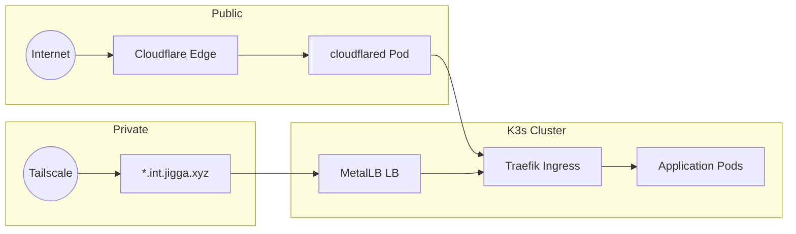

<table>
  <tr>
    <td></td>
    <td>
      <h2>jigga.xyz</h2>
      <p><strong>K3s homelab on Proxmox</strong></p>
      <p><strong>GitOps • Zero-trust networking</strong></p>
    </td>
  </tr>
</table>

---

## Quick Start

```bash
# 1. Initialize and deploy infrastructure
terraform init && terraform apply

# 2. Enable Kubernetes resources (update terraform.tfvars: deploy_kubernetes = true)
terraform apply
```

## Services

### Public Access (Cloudflare Tunnel)

| Service | URL | Purpose |
|---------|-----|---------|
| Homepage | https://jigga.xyz | Landing page |
| Vaultwarden | https://passwords.jigga.xyz | Password manager |

### Internal Access (Tailscale VPN)

| Service | URL | Purpose |
|---------|-----|---------|
| ArgoCD | https://argocd.int.jigga.xyz | GitOps deployments |
| Grafana | https://grafana.int.jigga.xyz | Monitoring dashboards |
| Prometheus | https://prometheus.int.jigga.xyz | Metrics collection |
| Alertmanager | https://alertmanager.int.jigga.xyz | Alert management |
| MQTT | https://mqtt.int.jigga.xyz | EMQX Dashboard |

> **Adding new apps?** See [docs/adding-new-applications.md](docs/adding-new-applications.md)

## Project Structure

```
├── k8s/                  # GitOps-managed Kubernetes manifests
│   ├── apps/             # Application definitions (Kustomize)
│   │   ├── _template/    # Template for new apps
│   │   ├── homepage/     # Homepage dashboard
│   │   ├── mqtt/         # EMQX MQTT broker
│   │   └── vaultwarden/  # Password manager
│   ├── clusters/         # Cluster-specific configuration
│   │   └── homelab/      # Homelab cluster
│   │       └── apps/     # ArgoCD Application CRDs
│   └── platform/         # Shared platform configs
│       ├── metallb/      # IP address pools
│       └── monitoring/   # Prometheus alerts
├── modules/              # Terraform modules
│   ├── proxmox/          # VM provisioning
│   ├── kubernetes/       # MetalLB, NFS storage
│   ├── monitoring/       # Prometheus, Grafana, Loki
│   ├── cert-manager/     # Let's Encrypt certificates
│   ├── ingress/          # Traefik ingress
│   ├── argocd/           # GitOps with ArgoCD + KSOPS
│   └── tailscale/        # VPN subnet routing
├── scripts/              # Management utilities
├── docs/                 # Documentation
└── templates/            # Terraform templates
```

## Prerequisites

- Proxmox server with API access
- SSH keypair for VM access
- Terraform installed locally

## Architecture

### Cluster Overview

| Node | Role | Public IP | Private IP |
|------|------|-----------|------------|
| ichigo | Control Plane | 192.168.7.223 | 10.0.0.10 |
| naruto | Worker | 192.168.7.224 | 10.0.0.11 |
| tanjiro | Worker | 192.168.7.225 | 10.0.0.12 |

**Resources**: 8 cores, 16GB RAM per node (48GB total)

### Network

- **Public Bridge**: 192.168.7.0/24 (vmbr0)
- **Private SDN**: 10.0.0.0/24 (VXLAN overlay)
- **MetalLB Pool**: 192.168.7.230-235
- **VPN**: WireGuard tunnel to home network

### Traffic Flow



## Terraform Modules

| Module | Purpose |
|--------|---------|
| `proxmox` | VM provisioning with cloud-init |
| `kubernetes` | MetalLB, NFS storage provisioner |
| `monitoring` | Prometheus, Grafana, Loki, Tempo, Mimir |
| `cert-manager` | Let's Encrypt certificate automation |
| `ingress` | Traefik ingress controller |
| `argocd` | GitOps continuous deployment |
| `cloudflare-tunnel` | Public access via Cloudflare network |
| `tailscale` | Private VPN access with subnet routing |

## Documentation

| Topic | Link |
|-------|------|
| **Documentation Index** | [docs/README.md](docs/README.md) |
| Architecture Overview | [docs/architecture-overview.md](docs/architecture-overview.md) |
| Network Architecture | [docs/network-architecture.md](docs/network-architecture.md) |
| SDN Configuration | [docs/sdn-configuration.md](docs/sdn-configuration.md) |
| Adding New Apps | [docs/adding-new-applications.md](docs/adding-new-applications.md) |
| **Secrets Management** | [docs/secrets-management.md](docs/secrets-management.md) |
| **Monitoring Guide** | [docs/monitoring-guide.md](docs/monitoring-guide.md) |
| Maintenance Guide | [docs/maintenance-guide.md](docs/maintenance-guide.md) |
| Scripts Reference | [scripts/README.md](scripts/README.md) |

## Port Forwarding

For local access without ingress:

```bash
# Grafana
kubectl port-forward svc/kube-prometheus-stack-grafana 3000:80 -n monitoring

# Prometheus
kubectl port-forward svc/kube-prometheus-stack-prometheus 9090:9090 -n monitoring

# MQTT Dashboard
kubectl port-forward svc/emqx 18083:18083 -n mqtt

# Traefik Dashboard
kubectl port-forward svc/traefik 9000:9000 -n kube-system
```

## Secrets Management (SOPS + AGE)

Secrets are encrypted with [SOPS](https://github.com/getsops/sops) using AGE encryption and decrypted at deploy time by ArgoCD with KSOPS.

```bash
# Encrypt a secret before committing
sops --encrypt --in-place k8s/apps/myapp/config/secret.yaml

# Decrypt a secret for editing
sops k8s/apps/myapp/config/secret.yaml

# Edit in-place (decrypts, opens editor, re-encrypts)
sops k8s/apps/myapp/config/secret.yaml
```

See [docs/secrets-management.md](docs/secrets-management.md) for full details.

## ArgoCD Private Repo Setup

ArgoCD uses SSH deploy keys to access private GitHub repositories.

```bash
# 1. Generate SSH deploy key
ssh-keygen -t ed25519 -C "argocd-deploy-key" -f ~/.ssh/argocd-deploy-key -N ""

# 2. Add public key to GitHub
cat ~/.ssh/argocd-deploy-key.pub
# Go to: GitHub repo → Settings → Deploy keys → Add deploy key

# 3. Create Kubernetes secret with private key
kubectl create secret generic github-repo-creds -n argocd \
  --from-literal=url=git@github.com:eosho/jigga.xyz.git \
  --from-file=sshPrivateKey=~/.ssh/argocd-deploy-key

# 4. Label secret for ArgoCD
kubectl label secret github-repo-creds -n argocd argocd.argoproj.io/secret-type=repository
```

ArgoCD Applications use SSH URL: `git@github.com:eosho/jigga.xyz.git`

## Notes

- Keep `terraform.tfvars` and secrets out of version control
- See [docs/monitoring-guide.md](docs/monitoring-guide.md) for monitoring configuration
- Backups run daily with automatic retention management