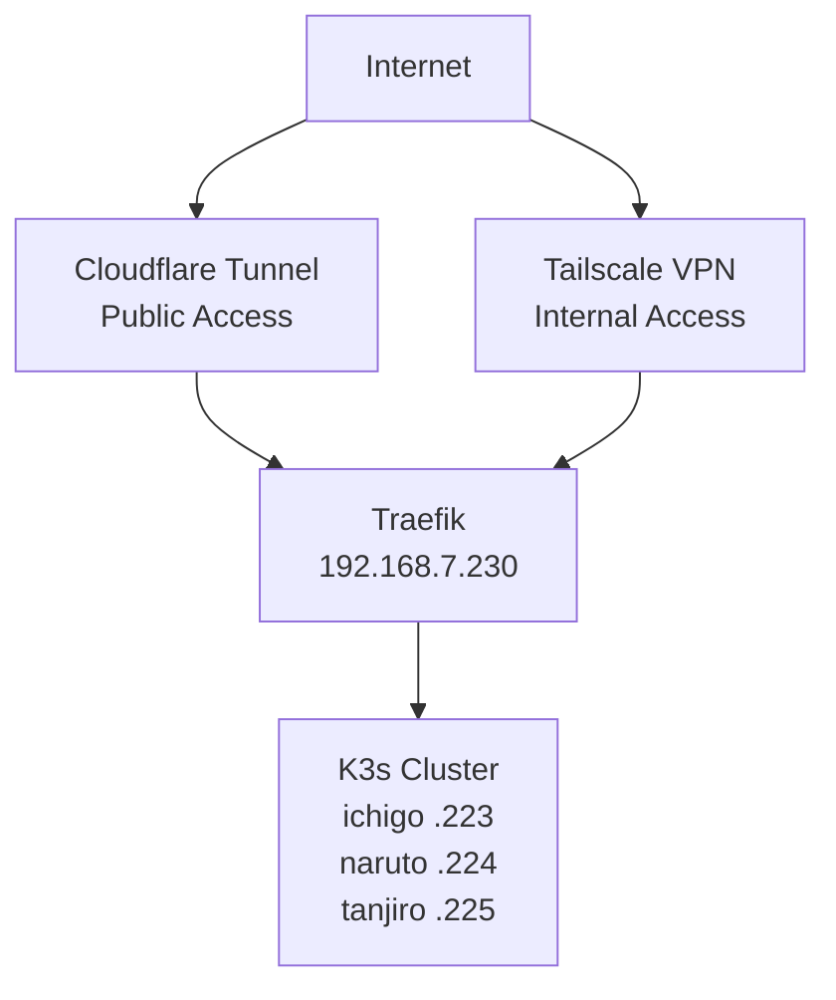

# Documentation Index

Start with the [main README](../README.md) for a quick overview, then return here for detailed guides.

## Documentation

### Core Documentation

| Document | Description |
|----------|-------------|
| [Applications & Endpoints](applications.md) | Quick reference for all apps, URLs, and credentials |
| [Architecture Overview](architecture-overview.md) | Complete infrastructure diagram and component overview |
| [Terraform + Ansible Architecture](terraform-ansible-architecture.md) | How Terraform and Ansible work together |
| [Network Architecture](network-architecture.md) | Detailed networking, traffic flows, and DNS configuration |
| [SDN Configuration](sdn-configuration.md) | Proxmox VXLAN overlay network setup |
| [Adding New Applications](adding-new-applications.md) | Guide for adding apps with GitOps and Kustomize |
| [Secrets Management](secrets-management.md) | SOPS + AGE encryption workflow for Kubernetes secrets |
| [Monitoring Guide](monitoring-guide.md) | Prometheus, Alertmanager, and Grafana usage |
| [Maintenance Guide](maintenance-guide.md) | Day-2 operations, troubleshooting, and disaster recovery |
| [Proxmox Maintenance](proxmox-maintenance.md) | Proxmox node updates and upgrade procedures |

---

## Infrastructure Summary

### Network Topology



### Quick Reference

| Component | Details |
|-----------|---------|
| **Nodes** | ichigo (control), naruto, tanjiro |
| **Node IPs** | 192.168.7.223-225 |
| **MetalLB Pool** | 192.168.7.230-235 |
| **Traefik** | 192.168.7.230 |
| **Pod Network** | 10.42.0.0/16 |
| **Service Network** | 10.43.0.0/16 |
| **SDN (Private)** | 10.0.0.0/24 |

### Access Methods

| Type | Domain Pattern | How It Works |
|------|---------------|--------------|
| **Public** | `*.jigga.xyz` | Cloudflare Tunnel -> cloudflared -> Service |
| **Internal** | `*.int.jigga.xyz` | Tailscale -> Traefik -> Service |

---

## Related Resources

### Terraform Modules

| Module | Purpose |
|--------|---------|
| [modules/proxmox](../modules/proxmox/) | VM provisioning |
| [modules/kubernetes](../modules/kubernetes/) | MetalLB, base K8s |
| [modules/cloudflare-tunnel](../modules/cloudflare-tunnel/) | Public access tunnel |
| [modules/tailscale](../modules/tailscale/) | VPN subnet routing |
| [modules/monitoring](../modules/monitoring/) | Prometheus stack |
| [modules/cert-manager](../modules/cert-manager/) | TLS certificates |
| [modules/argocd](../modules/argocd/) | GitOps deployments |

### Ansible Playbooks

| Playbook | Purpose |
|----------|---------|
| [proxmox-check-updates.yaml](../ansible/playbooks/proxmox-check-updates.yaml) | Check available Proxmox updates (safe/read-only) |
| [proxmox-upgrade.yaml](../ansible/playbooks/proxmox-upgrade.yaml) | Perform Proxmox dist-upgrade |
| [update-hosts.yaml](../ansible/playbooks/update-hosts.yaml) | Update /etc/hosts on cluster nodes |

### Kubernetes Manifests

| Directory | Purpose |
|-----------|---------|
| [kubernetes/](../kubernetes/) | Application manifests |
| [kubernetes/monitoring/](../kubernetes/monitoring/) | Monitoring configs |
| [kubernetes/traefik/](../kubernetes/traefik/) | Ingress routes |

---

## Common Tasks

### Deploy New Public Service

1. Add to `terraform.tfvars`:
```hcl
cloudflare_tunnel_ingress_rules = [
  # ... existing rules
  { hostname = "myapp.jigga.xyz", service = "http://myapp.myapp:80" }
]
```

2. Apply and restart:
```bash
terraform apply
kubectl rollout restart deployment/cloudflared -n cloudflare
```

See [Adding New Applications](adding-new-applications.md) for full guide.

### Access Internal Services

1. Connect to Tailscale
2. Navigate to `https://<service>.int.jigga.xyz`

### Check Cluster Health

```bash
kubectl get nodes
kubectl get pods -A | grep -v Running
kubectl top nodes
```

### Update Proxmox Nodes

```bash
cd ansible

# Check for available updates (safe, read-only)
ansible-playbook -i inventory.yaml playbooks/proxmox-check-updates.yaml

# Perform rolling upgrade with reboot
ansible-playbook -i inventory.yaml playbooks/proxmox-upgrade.yaml -e "serial=1" -e "reboot=true"
```

See [Proxmox Maintenance](proxmox-maintenance.md) for full guide.

### View Logs

```bash
# Application logs
kubectl logs -f deployment/<name> -n <namespace>

# Traefik access logs
kubectl logs -f -n kube-system -l app.kubernetes.io/name=traefik

# Cloudflare Tunnel
kubectl logs -f -n cloudflare -l app=cloudflared
```

---

## Monitoring Endpoints

| Service | Internal URL |
|---------|--------------|
| Grafana | https://grafana.int.jigga.xyz |
| Prometheus | https://prometheus.int.jigga.xyz |
| ArgoCD | https://argocd.int.jigga.xyz |
| Traefik Dashboard | `kubectl port-forward svc/traefik 9000:9000 -n kube-system` |

---

## Troubleshooting

| Issue | First Step |
|-------|-----------|
| Can't reach public site | Check cloudflared pods in `cloudflare` namespace |
| Can't reach internal site | Verify Tailscale connection |
| Pod stuck Pending | Check PVC status, node resources |
| Certificate error | Check cert-manager logs, Cloudflare API token |

See [Maintenance Guide](maintenance-guide.md) for detailed troubleshooting.
