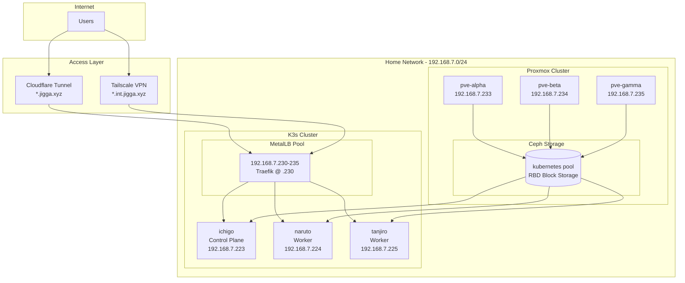
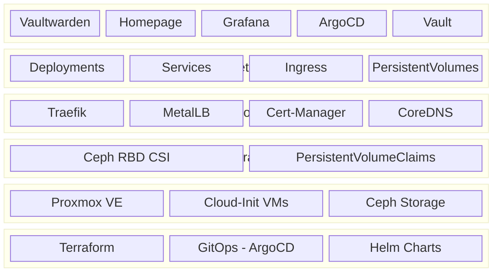

# Architecture Overview

**Navigation:** [Main README](../README.md) | [Documentation Index](README.md) | [Network Architecture](network-architecture.md)

Complete architecture documentation for the K3s homelab infrastructure running on Proxmox.

## Infrastructure Diagram

## Component Overview

### Proxmox Hypervisor Layer

| Component | Description |
|-----------|-------------|
| **Proxmox VE** | Virtualization platform (3-node cluster) |
| **Ceph Storage** | Distributed storage for VM disks and K8s PVs |
| **SDN (VXLAN)** | Software-defined overlay network for VM inter-communication |

### Kubernetes Layer

| Component | Description |
|-----------|-------------|
| **K3s** | Lightweight Kubernetes distribution |
| **MetalLB** | Bare-metal LoadBalancer (L2 mode) |
| **Traefik** | Ingress controller with automatic TLS |
| **Cert-Manager** | Let's Encrypt certificate automation |
| **Ceph CSI** | Storage provisioner for PersistentVolumes |

### Access Layer

| Component | Description |
|-----------|-------------|
| **Cloudflare Tunnel** | Zero-trust public access (no exposed ports) |
| **Tailscale** | Mesh VPN for secure internal access |
| **DNS (Cloudflare)** | Authoritative DNS with automatic records |

## Resource Allocation

### Total Cluster Resources

| Resource | Total | Per Node |
|----------|-------|----------|
| vCPUs | 20 cores | 8, 8, 4 |
| Memory | 48 GB | 16 GB |
| Storage | 384 GB | 128 GB |

### Kubernetes Network CIDRs

| Network | CIDR | Purpose |
|---------|------|---------|
| Pod Network | 10.42.0.0/16 | Container IPs |
| Service Network | 10.43.0.0/16 | ClusterIP services |
| MetalLB Pool | 192.168.7.224/29 | LoadBalancer IPs |

## Deployed Applications

### Infrastructure Services

| Service | Namespace | Access |
|---------|-----------|--------|
| Traefik | kube-system | LoadBalancer (192.168.7.230) |
| Cert-Manager | cert-manager | Internal |
| MetalLB | metallb-system | Internal |
| ArgoCD | argocd | Internal (argocd.int.jigga.xyz) |

### Monitoring Stack

| Service | Namespace | Access |
|---------|-----------|--------|
| Prometheus | monitoring | Internal |
| Grafana | monitoring | Internal (grafana.int.jigga.xyz) |
| Loki | monitoring | Internal |
| Alertmanager | monitoring | Internal |

### Applications

| Service | Namespace | Access |
|---------|-----------|--------|
| Vaultwarden | vaultwarden | Public (passwords.jigga.xyz) |
| Homepage | web | Public (jigga.xyz) |
| Vault | vault | Internal |

## Technology Stack

## Related Documentation

- [Network Architecture](network-architecture.md) - Detailed networking documentation
- [SDN Configuration](sdn-configuration.md) - Proxmox SDN setup
- [Adding New Applications](adding-new-applications.md) - Deployment guide
- [Maintenance Guide](maintenance-guide.md) - Day-2 operations
