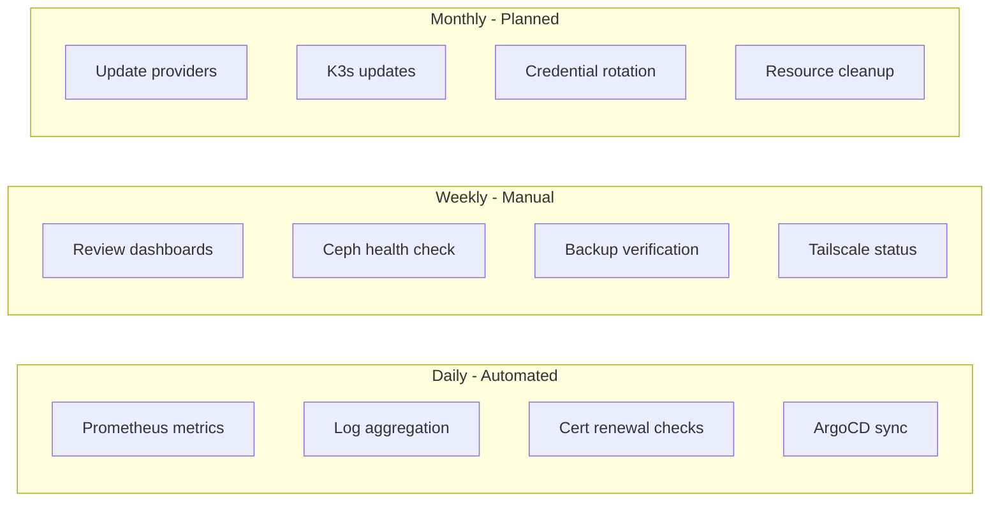
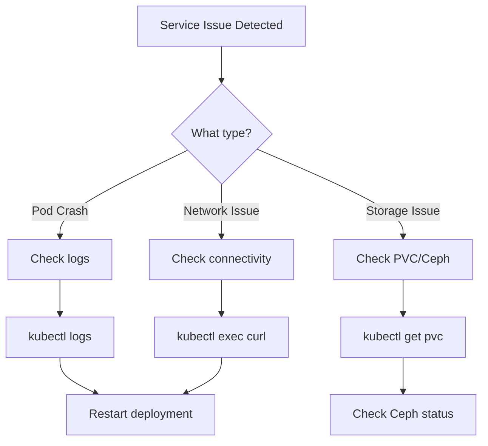
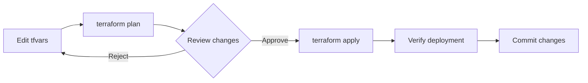
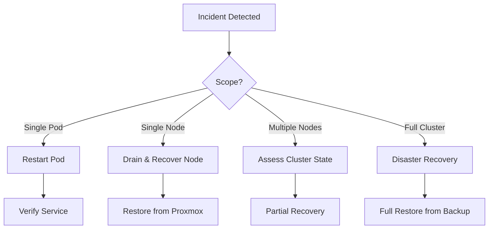

# Maintenance Guide

**Navigation:** [Main README](../README.md) | [Documentation Index](README.md) | [Architecture Overview](architecture-overview.md)

Day-2 operations guide for maintaining the K3s homelab infrastructure.

## Maintenance Schedule



### Daily (Automated)

- Prometheus metrics collection
- Log aggregation to Loki
- Certificate renewal checks (cert-manager)
- ArgoCD sync status monitoring

### Weekly

- Review Grafana dashboards for anomalies
- Check Ceph cluster health
- Verify backup integrity
- Review Tailscale device status

### Monthly

- Update Terraform providers
- Review and apply K3s updates
- Rotate sensitive credentials
- Clean up unused resources

## Common Operations

### Service Management



### Restarting Services

```bash
# Restart a deployment
kubectl rollout restart deployment/<name> -n <namespace>

# Restart Traefik
kubectl rollout restart deployment/traefik -n kube-system

# Restart cloudflared (Cloudflare Tunnel)
kubectl rollout restart deployment/cloudflared -n cloudflare

# Restart Tailscale operator
kubectl rollout restart deployment/operator -n tailscale
```

### Checking Service Health

```bash
# All pods status
kubectl get pods -A | grep -v Running

# Check specific namespace
kubectl get pods -n monitoring

# Describe problem pod
kubectl describe pod <pod-name> -n <namespace>

# View logs
kubectl logs -f deployment/<name> -n <namespace>
```

### Node Operations

```bash
# Cordon node (prevent new pods)
kubectl cordon <node-name>

# Drain node (evict pods)
kubectl drain <node-name> --ignore-daemonsets --delete-emptydir-data

# Uncordon node
kubectl uncordon <node-name>

# Node status
kubectl get nodes -o wide
```

## Terraform Operations

### Workflow



### Standard Commands

```bash
# Initialize (first time or after provider changes)
terraform init

# Plan changes
terraform plan -out=plan.tfplan

# Apply changes
terraform apply plan.tfplan

# Apply specific module
terraform apply -target=module.tailscale
```

### State Management

```bash
# View state
terraform state list

# Show specific resource
terraform state show module.cloudflare_tunnel.cloudflare_record.tunnel_dns["passwords.jigga.xyz"]

# Remove resource from state (if needed)
terraform state rm <resource>

# Import existing resource
terraform import <resource> <id>
```

### Updating Modules

```bash
# Update specific provider
terraform init -upgrade

# Lock provider versions
terraform providers lock
```

## Cloudflare Tunnel Management

### Add New Public Service

1. Edit `terraform.tfvars`:
```hcl
cloudflare_tunnel_ingress_rules = [
  { hostname = "jigga.xyz", service = "http://homepage.web:80" },
  { hostname = "passwords.jigga.xyz", service = "http://vaultwarden.vaultwarden:80" },
  { hostname = "newapp.jigga.xyz", service = "http://newapp.newapp:80" }  # Add this
]
```

2. Apply changes:
```bash
terraform apply
kubectl rollout restart deployment/cloudflared -n cloudflare
```

### Check Tunnel Status

```bash
# Cloudflared pods
kubectl get pods -n cloudflare

# Tunnel config
kubectl get configmap cloudflare-tunnel-config -n cloudflare -o yaml

# Logs
kubectl logs -n cloudflare -l app=cloudflared --tail=50
```

### Troubleshoot Tunnel Issues

```bash
# Check connections
kubectl exec -n cloudflare deploy/cloudflared -- cloudflared tunnel info

# Test connectivity from inside cluster
kubectl run curl --rm -it --image=curlimages/curl -- \
  curl -v http://vaultwarden.vaultwarden:80
```

## Tailscale Management

### Check Connector Status

```bash
# Connector status
kubectl get connector -n tailscale

# Detailed status
kubectl get connector k3s-router -n tailscale -o yaml

# Operator logs
kubectl logs -n tailscale -l app=operator --tail=50
```

### Advertised Routes

Current routes advertised by k3s-router:
- `10.42.0.0/16` - Pod network
- `10.43.0.0/16` - Service network
- `192.168.7.224/29` - MetalLB pool

### Update Routes

1. Edit `terraform.tfvars`:
```hcl
tailscale_advertised_routes = [
  "10.42.0.0/16",
  "10.43.0.0/16",
  "192.168.7.224/29",
  "192.168.7.0/24"  # Add new route
]
```

2. Apply:
```bash
terraform apply -target=module.tailscale
```

### Tailscale Admin Console

Access at [login.tailscale.com/admin](https://login.tailscale.com/admin):
- Approve routes under Machines -> k3s-router
- Manage ACLs under Access Controls
- View connection status

## Certificate Management

### Check Certificate Status

```bash
# All certificates
kubectl get certificates -A

# Certificate details
kubectl describe certificate <name> -n <namespace>

# Check cert-manager logs
kubectl logs -n cert-manager -l app=cert-manager --tail=50
```

### Force Certificate Renewal

```bash
# Delete certificate to trigger renewal
kubectl delete certificate <name> -n <namespace>

# Certificate will be recreated by Ingress/IngressRoute
```

### Troubleshoot DNS-01 Challenge

```bash
# Check challenges
kubectl get challenges -A

# Describe failing challenge
kubectl describe challenge <name> -n <namespace>

# Verify Cloudflare API token permissions
# Needs: Zone:DNS:Edit
```

## Ceph Storage

### Check Cluster Health

```bash
# SSH to Proxmox node
ssh root@192.168.7.233

# Cluster health
ceph health
ceph status

# OSD status
ceph osd tree

# Pool status
ceph osd pool ls detail
```

### PVC Operations

```bash
# List PVCs
kubectl get pvc -A

# Check PVC details
kubectl describe pvc <name> -n <namespace>

# Check PV
kubectl get pv | grep <pvc-name>
```

## Proxmox SDN

### Apply SDN Changes

```bash
# On Proxmox host
pvesh set /cluster/sdn
```

### Check SDN Status

```bash
# Zone status
pvesh get /cluster/sdn/zones

# VNet status
pvesh get /cluster/sdn/vnets

# Subnet status
pvesh get /cluster/sdn/vnets/k3svnet/subnets
```

## Backup Procedures

### ArgoCD Application Backup

```bash
# Export all applications
kubectl get applications -n argocd -o yaml > argocd-apps-backup.yaml

# Export app projects
kubectl get appprojects -n argocd -o yaml > argocd-projects-backup.yaml
```

### Secret Backup

```bash
# Export secrets (base64 encoded)
kubectl get secrets -n <namespace> -o yaml > secrets-backup.yaml

# IMPORTANT: Encrypt before storing!
```

### Terraform State Backup

```bash
# Copy state file
cp terraform.tfstate terraform.tfstate.backup.$(date +%Y%m%d)

# Consider remote state backend (S3, GCS, etc.)
```

## Disaster Recovery

### Recovery Decision Flow



### Node Failure Recovery

1. **Identify failed node**:
```bash
kubectl get nodes
```

2. **Cordon and drain**:
```bash
kubectl cordon <node>
kubectl drain <node> --ignore-daemonsets --force
```

3. **Recover or replace node** (Proxmox console)

4. **Rejoin cluster**:
```bash
# On recovered node
systemctl start k3s  # or k3s-agent
```

5. **Uncordon**:
```bash
kubectl uncordon <node>
```

### Full Cluster Recovery

1. Restore Proxmox VMs from backup
2. Apply Terraform configuration
3. Restore ArgoCD applications
4. Verify all services

### Emergency Contacts

| Service | Documentation |
|---------|---------------|
| Cloudflare | [developers.cloudflare.com](https://developers.cloudflare.com) |
| Tailscale | [tailscale.com/kb](https://tailscale.com/kb) |
| K3s | [docs.k3s.io](https://docs.k3s.io) |
| Proxmox | [pve.proxmox.com/wiki](https://pve.proxmox.com/wiki) |

## Monitoring Dashboards

### Key Metrics to Watch

| Metric | Warning Threshold | Critical Threshold |
|--------|------------------|-------------------|
| Node CPU | 70% | 90% |
| Node Memory | 80% | 95% |
| Disk Usage | 75% | 90% |
| Pod Restarts | 3/hour | 10/hour |

### Access Dashboards

| Service | URL |
|---------|-----|
| Grafana | https://grafana.int.jigga.xyz |
| Prometheus | https://prometheus.int.jigga.xyz |
| Traefik | `kubectl port-forward svc/traefik 9000:9000 -n kube-system` |

## Related Documentation

- [Architecture Overview](architecture-overview.md) - Infrastructure diagram
- [Network Architecture](network-architecture.md) - Networking details
- [SDN Configuration](sdn-configuration.md) - VXLAN overlay
- [Adding New Applications](adding-new-applications.md) - Deployment guide
