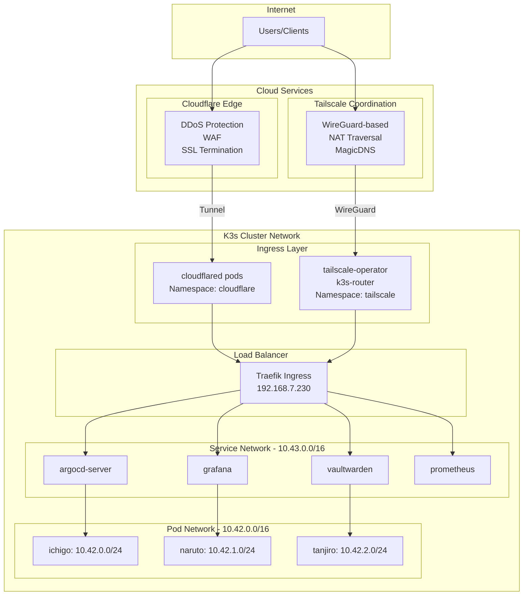
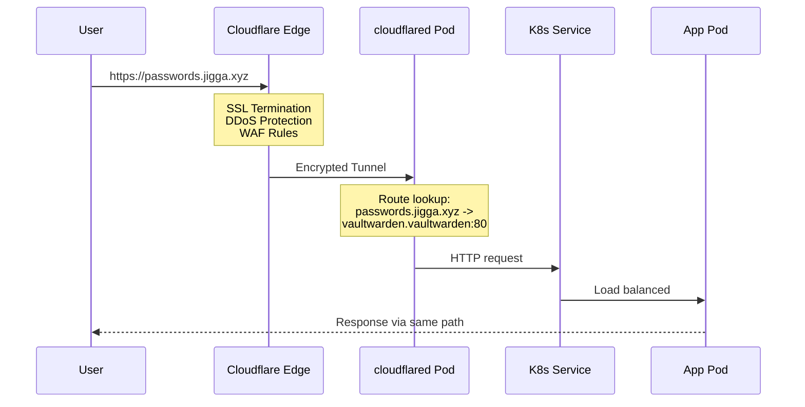
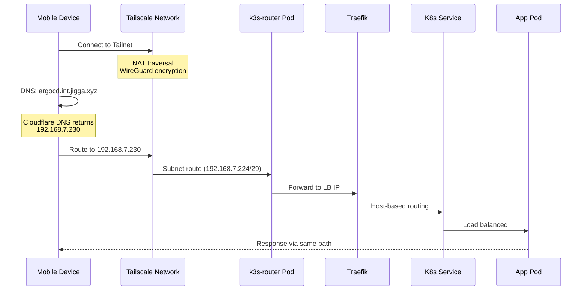
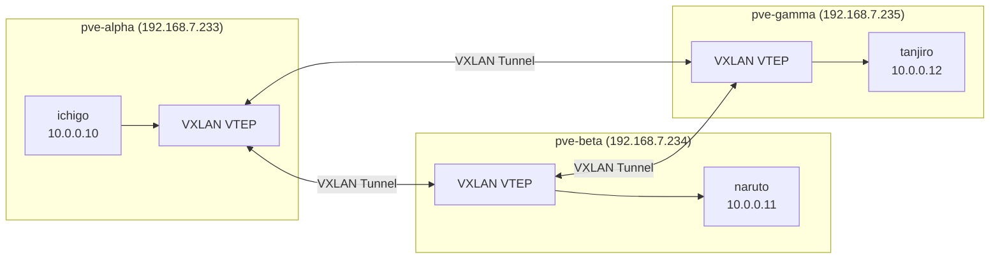
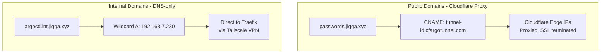

# Network Architecture

**Navigation:** [Main README](../README.md) | [Documentation Index](README.md) | [Architecture Overview](architecture-overview.md)

Comprehensive network documentation for the K3s homelab infrastructure.

## Network Topology



## IP Address Allocation

### Home Network (192.168.7.0/24)

| IP Range | Purpose | Devices |
|----------|---------|---------|
| 192.168.7.1 | Gateway | Router |
| 192.168.7.223-225 | K3s Nodes | ichigo, naruto, tanjiro |
| 192.168.7.230-235 | MetalLB Pool | LoadBalancer services |
| 192.168.7.233-235 | Proxmox Hosts | pve-alpha, beta, gamma |

### SDN Private Network (10.0.0.0/24)

| IP | Purpose |
|----|---------|
| 10.0.0.1 | Gateway (virtual) |
| 10.0.0.10 | ichigo (private) |
| 10.0.0.11 | naruto (private) |
| 10.0.0.12 | tanjiro (private) |

### Kubernetes Networks

| Network | CIDR | Purpose |
|---------|------|---------|
| Pod Network | 10.42.0.0/16 | Container networking |
| Service Network | 10.43.0.0/16 | ClusterIP services |
| CoreDNS | 10.43.0.10 | Cluster DNS |

### Tailscale Networks

| Network | Purpose |
|---------|---------|
| 100.x.x.x/8 | Tailscale device IPs |
| Advertised Routes | 10.42.0.0/16, 10.43.0.0/16, 192.168.7.224/29 |

## Traffic Flow Diagrams

### Public Access via Cloudflare Tunnel



**Flow Description:**
1. User requests `https://passwords.jigga.xyz`
2. DNS resolves to Cloudflare Edge (CNAME to tunnel.cfargotunnel.com)
3. Cloudflare terminates SSL, applies security rules
4. Request forwarded through encrypted tunnel to cloudflared pod
5. cloudflared looks up hostname in ConfigMap
6. Routes to internal service: `http://vaultwarden.vaultwarden:80`
7. Response returns via same path

### Internal Access via Tailscale VPN



**Flow Description:**
1. Device connects to Tailscale VPN
2. DNS query: `argocd.int.jigga.xyz` resolves to 192.168.7.230 (Cloudflare)
3. Device routes 192.168.7.230 via Tailscale (advertised subnet)
4. k3s-router forwards to Traefik LoadBalancer
5. Traefik matches Host header, routes to argocd-server
6. Response returns via same path

### Inter-Node Communication via SDN



**Traffic Path:** VM sends packet to k3svnet bridge, VTEP encapsulates in VXLAN, physical network transports UDP packet, remote VTEP decapsulates, delivers to destination VM.

## DNS Configuration

### Cloudflare DNS Records

| Record | Type | Value | Proxied | Purpose |
|--------|------|-------|---------|---------|
| `jigga.xyz` | CNAME | `<tunnel-id>.cfargotunnel.com` | Yes | Homepage |
| `passwords.jigga.xyz` | CNAME | `<tunnel-id>.cfargotunnel.com` | Yes | Vaultwarden |
| `*.int.jigga.xyz` | A | `192.168.7.230` | No | Internal wildcard |

### DNS Resolution Flow



## MetalLB Configuration

### IP Pool

```yaml
apiVersion: metallb.io/v1beta1
kind: IPAddressPool
metadata:
  name: default-pool
  namespace: metallb-system
spec:
  addresses:
    - 192.168.7.230-192.168.7.235
```

### Current Allocations

| IP | Service | Namespace |
|----|---------|-----------|
| 192.168.7.230 | traefik | kube-system |
| 192.168.7.231-235 | Available | - |

### L2 Advertisement

```yaml
apiVersion: metallb.io/v1beta1
kind: L2Advertisement
metadata:
  name: default
  namespace: metallb-system
spec:
  ipAddressPools:
    - default-pool
```

## Firewall Rules

### Required Ports (Home Network)

| Port | Protocol | Source | Destination | Purpose |
|------|----------|--------|-------------|---------|
| 6443 | TCP | 192.168.7.0/24 | K3s nodes | Kubernetes API |
| 51820 | UDP | Tailscale | K3s nodes | WireGuard |
| 80/443 | TCP | MetalLB Pool | Any | HTTP/HTTPS |

### Kubernetes Network Policies

Currently using default allow-all. Consider implementing:

```yaml
# Example: Restrict pod-to-pod traffic
apiVersion: networking.k8s.io/v1
kind: NetworkPolicy
metadata:
  name: default-deny-ingress
spec:
  podSelector: {}
  policyTypes:
    - Ingress
```

## Troubleshooting

### Check Network Connectivity

```bash
# Test DNS resolution
nslookup passwords.jigga.xyz
nslookup argocd.int.jigga.xyz

# Test Cloudflare tunnel
kubectl logs -n cloudflare -l app=cloudflared --tail=20

# Test Tailscale connectivity
kubectl get connector -n tailscale
kubectl logs -n tailscale -l app=operator --tail=20

# Test MetalLB
kubectl get svc -A | grep LoadBalancer
```

### Common Issues

| Symptom | Likely Cause | Solution |
|---------|--------------|----------|
| Public site unreachable | cloudflared pod down | `kubectl rollout restart deployment/cloudflared -n cloudflare` |
| Internal site unreachable | Not on Tailscale | Connect to Tailscale VPN |
| 502 Bad Gateway | Backend service down | Check app pod status |
| Certificate error | cert-manager issue | Check cert-manager logs |

## Related Documentation

- [Architecture Overview](architecture-overview.md) - Infrastructure diagram
- [SDN Configuration](sdn-configuration.md) - VXLAN overlay details
- [Maintenance Guide](maintenance-guide.md) - Troubleshooting procedures
