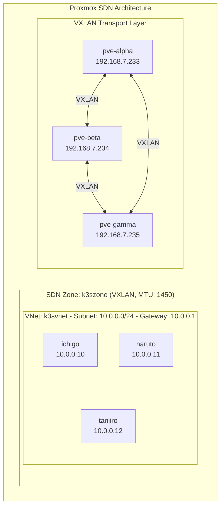
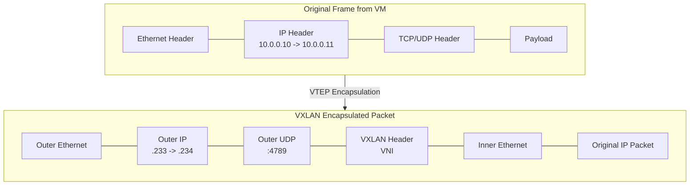
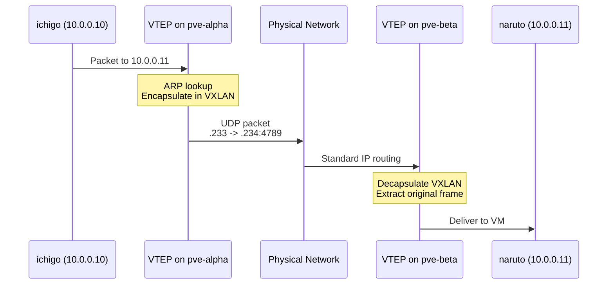

# Proxmox SDN Configuration

**Navigation:** [Main README](../README.md) | [Documentation Index](README.md) | [Network Architecture](network-architecture.md)

Documentation for the Proxmox Software-Defined Networking (SDN) VXLAN overlay used for cluster-internal communication.

## Overview

The SDN provides a private overlay network for K3s node communication, isolating cluster traffic from the public LAN.



## Configuration

### Terraform Variables

```hcl
# terraform.tfvars
enable_sdn = true
sdn_zone_id    = "k3szone"
sdn_vnet_id    = "k3svnet"
sdn_vnet_alias = "K3s Cluster Overlay Network"
proxmox_node_ips = ["192.168.7.233", "192.168.7.234", "192.168.7.235"]

sdn_mtu            = 1450           # 50 bytes less than physical MTU
sdn_subnet_cidr    = "10.0.0.0/24"
sdn_subnet_gateway = "10.0.0.1"
```

### Terraform Module

The SDN is configured via `modules/proxmox/sdn/`:

```hcl
# modules/proxmox/sdn/main.tf
resource "proxmox_virtual_environment_sdn_zone" "vxlan_zone" {
  zone_id = var.zone_id
  type    = "vxlan"
  peers   = var.proxmox_node_ips
  mtu     = var.mtu
}

resource "proxmox_virtual_environment_sdn_vnet" "cluster_vnet" {
  vnet_id = var.vnet_id
  zone    = proxmox_virtual_environment_sdn_zone.vxlan_zone.zone_id
  alias   = var.vnet_alias
}

resource "proxmox_virtual_environment_sdn_subnet" "cluster_subnet" {
  vnet   = proxmox_virtual_environment_sdn_vnet.cluster_vnet.vnet_id
  cidr   = var.subnet_cidr
  gateway = var.subnet_gateway
}
```

## How VXLAN Works

### Encapsulation Process



**MTU Consideration:**
- Physical MTU: 1500 bytes
- VXLAN overhead: ~50 bytes (outer headers)
- Inner MTU: 1450 bytes

### Traffic Flow Example



## VM Network Configuration

### Dual-NIC Setup

Each K3s VM has two network interfaces:

| Interface | Bridge | Network | Purpose |
|-----------|--------|---------|---------|
| eth0 | vmbr0 | 192.168.7.0/24 | Public/LAN access |
| eth1 | k3svnet | 10.0.0.0/24 | Private/SDN |

### Cloud-Init Configuration

```yaml
# Configured via Terraform cloud-init
network:
  version: 2
  ethernets:
    eth0:
      addresses:
        - 192.168.7.223/24
      gateway4: 192.168.7.1
      nameservers:
        addresses:
          - 1.1.1.1
          - 8.8.8.8
    eth1:
      addresses:
        - 10.0.0.10/24
```

## Verification Commands

### On Proxmox Host

```bash
# Check SDN zone status
pvesh get /cluster/sdn/zones

# Check VNet configuration
pvesh get /cluster/sdn/vnets

# View VXLAN interfaces
ip -d link show | grep vxlan

# Check bridge status
brctl show | grep k3svnet

# Verify VXLAN peers
bridge fdb show dev vxlan_k3szone | grep dst
```

### On K3s Nodes

```bash
# Check network interfaces
ip addr show

# Verify SDN interface
ip addr show eth1

# Test inter-node connectivity (SDN)
ping -c 3 10.0.0.11  # From ichigo to naruto

# Check routing
ip route show
```

### Expected Output

```bash
# ip addr show eth1 (on ichigo)
3: eth1: <BROADCAST,MULTICAST,UP,LOWER_UP> mtu 1450 qdisc fq_codel state UP
    inet 10.0.0.10/24 brd 10.0.0.255 scope global eth1

# ping 10.0.0.11
PING 10.0.0.11 (10.0.0.11) 56(84) bytes of data.
64 bytes from 10.0.0.11: icmp_seq=1 ttl=64 time=0.523 ms
```

## Troubleshooting

### SDN Not Working

```bash
# 1. Apply pending SDN changes
pvesh set /cluster/sdn

# 2. Restart networking on nodes
systemctl restart networking

# 3. Verify zone is active
pvesh get /cluster/sdn/zones/k3szone
```

### Common Issues

| Symptom | Cause | Solution |
|---------|-------|----------|
| No ARP responses | VXLAN not applied | Run `pvesh set /cluster/sdn` |
| MTU issues | Fragmentation | Ensure inner MTU is 1450 |
| One-way traffic | Asymmetric config | Check all node peer lists |
| Bridge missing | SDN not deployed | Verify VNet exists in Proxmox UI |

### Diagnostic Commands

```bash
# Check if VXLAN interface exists
ip link show | grep vxlan

# Verify bridge forwarding database
bridge fdb show | grep k3szone

# Check for packet drops
ip -s link show eth1

# Monitor VXLAN traffic
tcpdump -i vmbr0 port 4789
```

## Related Documentation

- [Network Architecture](network-architecture.md) - Complete network overview
- [Architecture Overview](architecture-overview.md) - Infrastructure diagram
- [Maintenance Guide](maintenance-guide.md) - Day-2 operations
