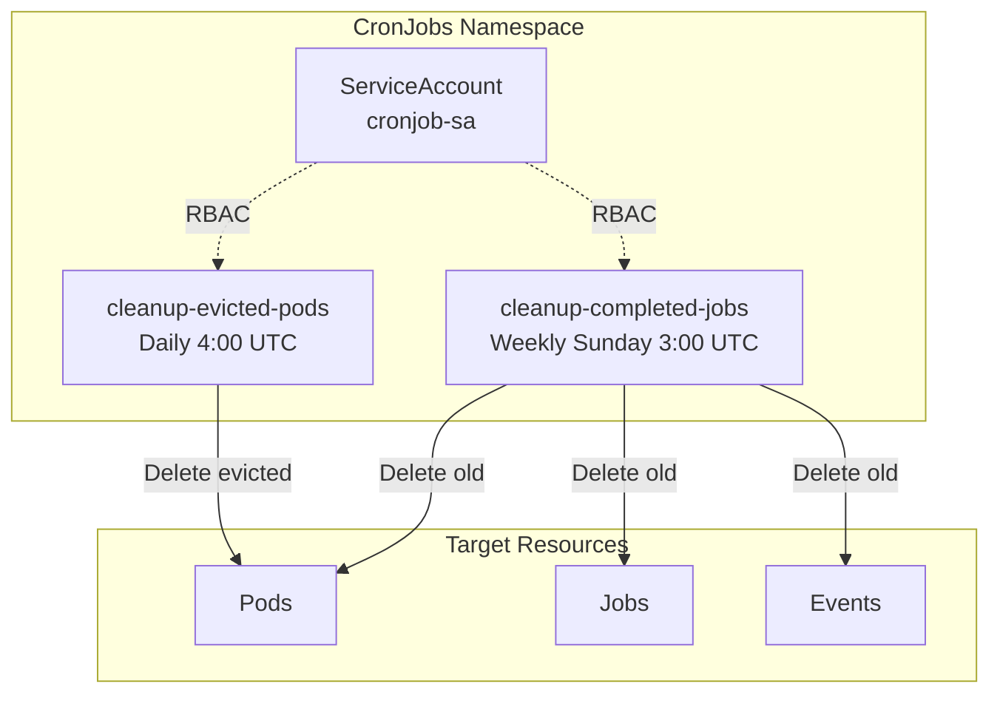

# CronJobs

Centralized management of scheduled cleanup tasks for the homelab cluster.

## Architecture



## CronJobs

| Name | Schedule | Description |
|------|----------|-------------|
| `cleanup-completed-jobs` | Sunday 3:00 UTC | Cleans up old completed/failed pods, jobs, and events |
| `cleanup-evicted-pods` | Daily 4:00 UTC | Removes pods evicted due to resource pressure |

> **Note:** Certificate monitoring is handled natively via PrometheusRules in `k8s/platform/monitoring/alerts/certificate-alerts.yaml`

## Manual Execution

To run a CronJob manually:

```bash
# Cleanup jobs
kubectl create job --from=cronjob/cleanup-completed-jobs cleanup-manual -n cronjobs

# Evicted pods cleanup
kubectl create job --from=cronjob/cleanup-evicted-pods evicted-cleanup-manual -n cronjobs
```

## View Logs

```bash
# Latest cleanup
kubectl logs -n cronjobs -l app.kubernetes.io/component=cleanup --tail=100
```

## Check Status

```bash
# List all CronJobs
kubectl get cronjobs -n cronjobs

# List recent jobs
kubectl get jobs -n cronjobs --sort-by=.metadata.creationTimestamp

# Check last successful run
kubectl get cronjob -n cronjobs -o custom-columns=NAME:.metadata.name,LAST_SCHEDULE:.status.lastScheduleTime,LAST_SUCCESS:.status.lastSuccessfulTime
```

## Note on PostgreSQL Backups

PostgreSQL backups are managed separately in the `postgres` namespace to:
- Keep backup credentials scoped to the postgres namespace
- Store backups on NFS directly from the postgres app
- Maintain clear separation of database operations

See [postgres README](../postgres/README.md) for backup details.
