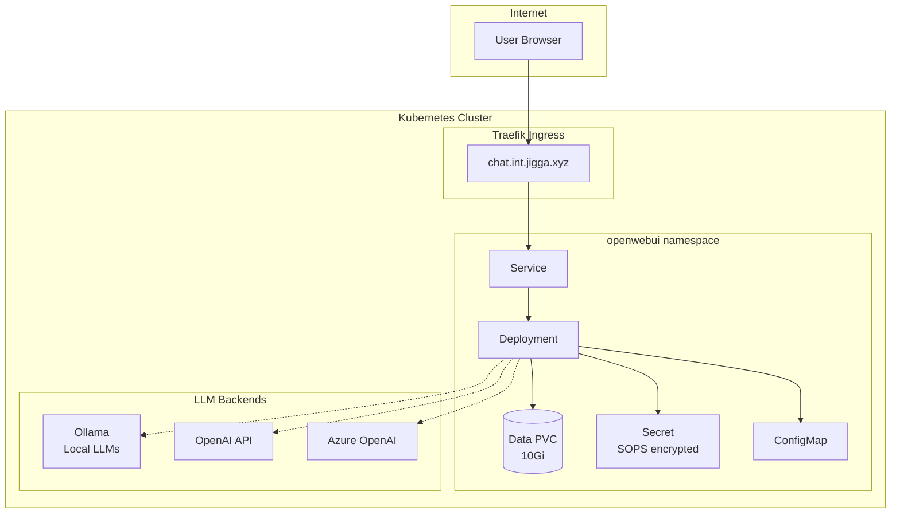

# Open WebUI

Open WebUI is a self-hosted, extensible AI chat interface that supports multiple LLM backends including Ollama and OpenAI-compatible APIs.

## Features

- 🤖 Multiple LLM backend support (Ollama, OpenAI, Azure OpenAI, etc.)
- 💬 Conversation history and management
- 📁 Document upload and RAG capabilities
- 🔒 User authentication and role-based access
- 🎨 Customizable themes and interface
- 🔌 Plugin and extension support

## Access

- **URL**: https://chat.int.jigga.xyz
- **First User**: The first user to register becomes the administrator

## Configuration

### Environment Variables

Key configuration is managed via ConfigMap and Secrets:

| Variable | Description | Default |
|----------|-------------|---------|
| `WEBUI_URL` | Public URL for the instance | `https://chat.int.jigga.xyz` |
| `WEBUI_NAME` | Display name for the WebUI | `Open WebUI` |
| `DEFAULT_USER_ROLE` | Role for new users | `pending` (requires admin approval) |
| `ENABLE_OLLAMA_API` | Enable Ollama backend | `false` |
| `ENABLE_OPENAI_API` | Enable OpenAI-compatible backend | `true` |

### Secrets

Secrets are encrypted with SOPS and managed via KSOPS:

| Secret | Description |
|--------|-------------|
| `WEBUI_SECRET_KEY` | JWT and OAuth token encryption key |
| `OPENAI_API_KEY` | OpenAI API key (optional) |

## Setup Instructions

### 1. Create the Secret

Before deploying, create and encrypt the secret:

```bash
# Copy the template
cp config/secret.yaml.template config/secret.yaml

# Generate a secret key
SECRET_KEY=$(openssl rand -hex 32)
echo "Generated secret key: $SECRET_KEY"

# Edit config/secret.yaml and replace REPLACE_WITH_GENERATED_SECRET

# Encrypt with SOPS
sops -e -i config/secret.yaml
```

### 2. Configure LLM Backend

#### Option A: OpenAI API

Add your OpenAI API key to the secret:

```yaml
stringData:
  WEBUI_SECRET_KEY: "your-generated-key"
  OPENAI_API_KEY: "sk-your-openai-key"
```

#### Option B: Ollama (Local LLMs)

1. Deploy Ollama in your cluster
2. Update the ConfigMap:

```yaml
ENABLE_OLLAMA_API: "true"
OLLAMA_BASE_URL: "http://ollama.ollama.svc.cluster.local:11434"
```

#### Option C: Azure OpenAI

Add Azure credentials to the secret:

```yaml
stringData:
  WEBUI_SECRET_KEY: "your-generated-key"
  OPENAI_API_KEY: "your-azure-api-key"
  OPENAI_API_BASE_URL: "https://your-resource.openai.azure.com/openai/deployments/your-deployment"
```

## Architecture



## Storage

| PVC | Size | Storage Class | Purpose |
|-----|------|---------------|---------|
| `openwebui-data` | 10Gi | `ceph-rbd` | User data, conversations, uploads |

## Upgrading

Open WebUI is pinned to a specific version in the deployment. To upgrade:

1. Check the [release notes](https://github.com/open-webui/open-webui/releases)
2. Update the image tag in `workload/deployment.yaml`
3. Commit and push - ArgoCD will sync automatically

⚠️ **Note**: When upgrading, the first pod startup runs database migrations. With a single replica, this is safe. For HA deployments, see the official docs.

## Troubleshooting

### Check Pod Status

```bash
kubectl get pods -n openwebui
kubectl logs -n openwebui -l app.kubernetes.io/name=openwebui
```

### Check Events

```bash
kubectl get events -n openwebui --sort-by='.lastTimestamp'
```

### Access Shell

```bash
kubectl exec -it -n openwebui deploy/openwebui -- /bin/bash
```

### Common Issues

1. **Pod stuck in Pending**: Check PVC binding
2. **CrashLoopBackOff**: Check logs for secret/config issues
3. **Login not working**: Ensure `WEBUI_SECRET_KEY` is set and consistent

## Resources

- [Open WebUI Documentation](https://docs.openwebui.com/)
- [GitHub Repository](https://github.com/open-webui/open-webui)
- [Environment Variables Reference](https://docs.openwebui.com/getting-started/env-configuration)
