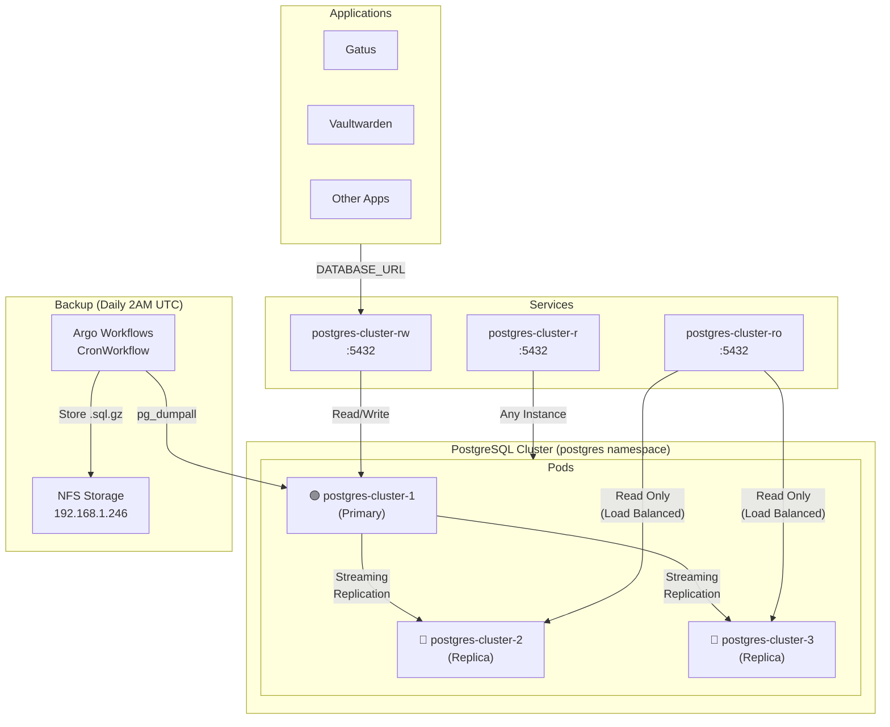
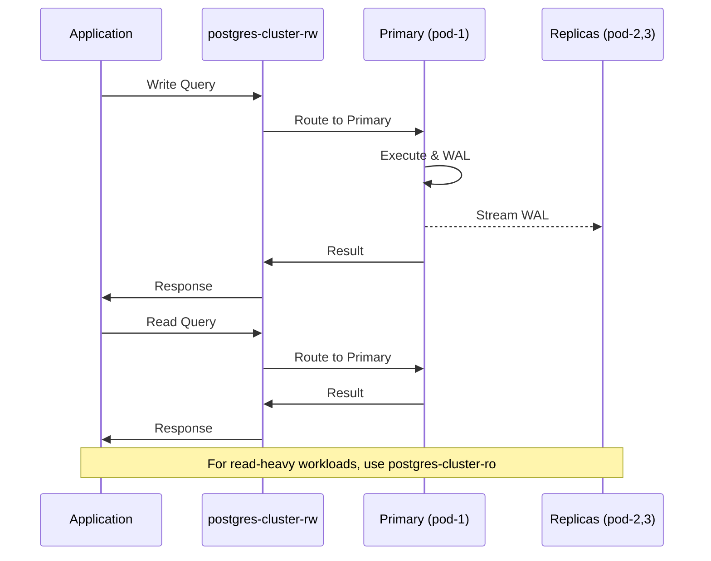

# PostgreSQL (CloudNativePG)

High-availability PostgreSQL cluster managed by CloudNativePG operator.

## Architecture



### Data Flow



## Configuration

| Setting | Value |
|---------|-------|
| **PostgreSQL Version** | 18 |
| **Replicas** | 3 (1 primary + 2 replicas) |
| **Storage Class** | `ceph-rbd` |
| **Storage Size** | 10Gi per instance |
| **Namespace** | `postgres` |

## Databases

| Database | Used By | Description |
|----------|---------|-------------|
| `gatus` | Gatus | Status monitoring data |
| `vaultwarden` | Vaultwarden | Password manager data |
| `app` | Default | General purpose |

## Connection Strings

### For Applications (inside cluster)

```
# Read-Write (Primary)
postgresql://app:<password>@postgres-cluster-rw.postgres.svc.cluster.local:5432/<database>

# Read-Only (Replicas)
postgresql://app:<password>@postgres-cluster-ro.postgres.svc.cluster.local:5432/<database>
```

### Get Credentials

```bash
# App user password
kubectl get secret postgres-cluster-app -n postgres -o jsonpath='{.data.password}' | base64 -d

# Superuser password (for admin tasks only)
kubectl get secret postgres-superuser -n postgres -o jsonpath='{.data.password}' | base64 -d
```

## Backups

### Schedule

Daily at **2:00 AM UTC** via Argo Workflows CronWorkflow.

### Backup Method

- **Tool**: `pg_dumpall` (logical backup)
- **Format**: Gzipped SQL (`.sql.gz`)
- **Storage**: NFS (`192.168.1.246:/mnt/truenas-pool/pve/k8s/postgres`)
- **Retention**: Last 7 backups

### Manual Backup

```bash
# Trigger immediate backup via Argo Workflows
kubectl -n argo-workflows create -f - <<EOF
apiVersion: argoproj.io/v1alpha1
kind: Workflow
metadata:
  generateName: manual-backup-
spec:
  workflowTemplateRef:
    name: postgres-backup
EOF

# Check backup status
kubectl -n argo-workflows get wf -l workflows.argoproj.io/workflow-template=postgres-backup

# View backup logs
kubectl -n argo-workflows logs -l workflows.argoproj.io/workflow-template=postgres-backup --tail=50
```

### List Backups

```bash
# Via scripts
./scripts/postgres-restore.sh --list

# Or check NFS directly
kubectl run --rm -it backup-list --image=alpine:3.19 --restart=Never -- \
  sh -c "ls -lht /backup/postgres-backup-*.sql.gz | head -10"
```

### Restore

Restore is handled via Argo Workflows with an approval gate:

```bash
# Restore specific database (with approval gate)
kubectl -n argo-workflows create -f - <<EOF
apiVersion: argoproj.io/v1alpha1
kind: Workflow
metadata:
  generateName: restore-
spec:
  workflowTemplateRef:
    name: postgres-restore
  arguments:
    parameters:
      - name: backup-file
        value: "latest"
      - name: target-database
        value: "gatus"
EOF

# Or use the restore script for local execution
./scripts/postgres-restore.sh postgres-backup-YYYYMMDD-HHMMSS.sql.gz --database gatus
```

See [Maintenance Guide](../../docs/maintenance-guide.md#scheduled-tasks-argo-workflows) for full restore procedures.

## Monitoring

### pgAdmin

Web-based PostgreSQL administration at: **https://pgadmin.int.jigga.xyz**

```bash
# Get pgAdmin credentials
kubectl get secret pgadmin-secret -n pgadmin -o jsonpath='{.data.PGADMIN_DEFAULT_PASSWORD}' | base64 -d
```

### Prometheus Alerts

| Alert | Severity | Description |
|-------|----------|-------------|
| `PostgresClusterNotHealthy` | Critical | Cluster has unhealthy instances |
| `PostgresClusterNoLeader` | Critical | No primary instance |
| `PostgresReplicationLagHigh` | Warning | Replication lag > 30s |
| `PostgresConnectionsHigh` | Warning | Connections > 80% |
| `PostgresBackupWorkflowFailed` | Critical | Backup workflow failed |
| `PostgresBackupWorkflowMissing` | Warning | No backup in 25 hours |

### Useful Commands

```bash
# Check cluster status
kubectl get cluster.postgresql.cnpg.io -n postgres

# Check pod status
kubectl get pods -n postgres -l cnpg.io/cluster=postgres-cluster

# View primary pod
kubectl get pods -n postgres -l cnpg.io/cluster=postgres-cluster,role=primary

# Connect to PostgreSQL
kubectl exec -it postgres-cluster-1 -n postgres -- psql -U postgres

# List databases
kubectl exec postgres-cluster-1 -n postgres -- psql -U postgres -c "SELECT datname FROM pg_database;"

# Check replication status
kubectl exec postgres-cluster-1 -n postgres -- psql -U postgres -c "SELECT * FROM pg_stat_replication;"
```

## Adding a New Database

1. Connect to primary:
   ```bash
   kubectl exec -it postgres-cluster-1 -n postgres -- psql -U postgres
   ```

2. Create database:
   ```sql
   CREATE DATABASE myapp;
   GRANT ALL PRIVILEGES ON DATABASE myapp TO app;
   ```

3. Update your application's secret with the connection string.

## Troubleshooting

### Cluster Not Healthy

```bash
# Check CloudNativePG operator logs
kubectl logs -n cnpg-system -l app.kubernetes.io/name=cloudnative-pg

# Check cluster events
kubectl describe cluster.postgresql.cnpg.io postgres-cluster -n postgres
```

### Backup Failed

```bash
# Check Argo CronWorkflow status
kubectl -n argo-workflows get cronwf postgres-daily-backup

# Check recent workflow runs
kubectl -n argo-workflows get wf -l workflows.argoproj.io/cron-workflow=postgres-daily-backup

# View workflow logs
kubectl -n argo-workflows logs <workflow-name>

# Verify NFS mount (from workflow pod or manually)
kubectl run --rm -it nfs-check --image=alpine:3.19 --restart=Never -- ls -la /backup/
```

### Connection Issues

```bash
# Test connectivity from within cluster
kubectl run -it --rm pg-test --image=postgres:18 --restart=Never -- \
  psql postgresql://app:<password>@postgres-cluster-rw.postgres.svc.cluster.local:5432/postgres -c "SELECT 1;"
```

## Files

```
k8s/apps/postgres/
├── config/
│   └── backup-volume.yaml    # NFS PV/PVC for backups
├── workload/
│   └── cluster.yaml          # CloudNativePG Cluster resource
├── kustomization.yaml
├── namespace.yaml
├── secret-generator.yaml     # KSOPS generator for secrets
└── README.md
```

Note: Scheduled backups are managed by Argo Workflows CronWorkflows.
See `k8s/apps/argo-workflows/workflows/cron/postgres-daily-backup.yaml`.
