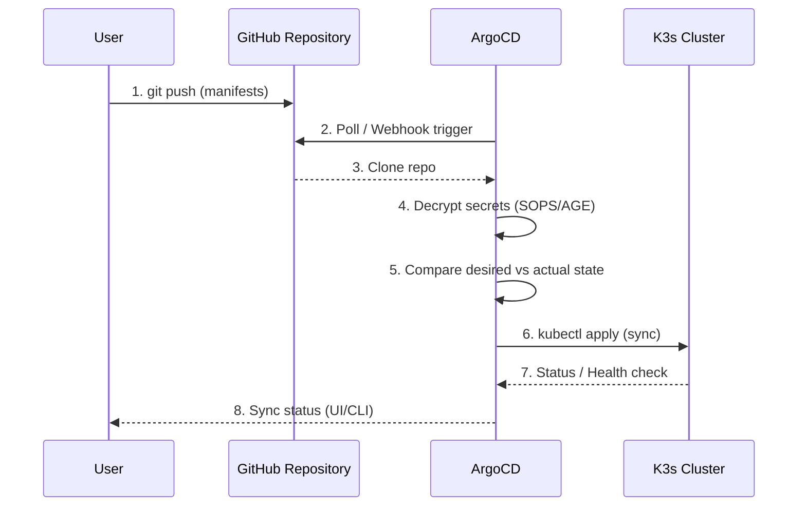

# ArgoCD Module

GitOps continuous delivery tool for Kubernetes.

## Overview

This module deploys [ArgoCD](https://argo-cd.readthedocs.io/) on the K3s cluster using Helm. ArgoCD watches Git repositories and automatically syncs Kubernetes manifests to the cluster.

## Architecture



## Access

| Item | Value |
|------|-------|
| **URL** | https://argocd.int.jigga.xyz |
| **Username** | `admin` |
| **Password** | See below |

## Getting Credentials

### Get Initial Admin Password

```bash
# Using kubeconfig
kubectl --kubeconfig=kubeconfig.yaml -n argocd get secret argocd-initial-admin-secret -o jsonpath='{.data.password}' | base64 -d

# Or if kubeconfig is in default location
kubectl -n argocd get secret argocd-initial-admin-secret -o jsonpath='{.data.password}' | base64 -d
```

### Reset Admin Password

If you need to reset the password:

```bash
# Generate bcrypt hash of new password
NEW_PASSWORD="your-new-password"
BCRYPT_HASH=$(htpasswd -nbBC 10 "" "$NEW_PASSWORD" | tr -d ':\n' | sed 's/$2y/$2a/')

# Update the secret
kubectl --kubeconfig=kubeconfig.yaml -n argocd patch secret argocd-secret \
  -p '{"stringData": {"admin.password": "'$BCRYPT_HASH'", "admin.passwordMtime": "'$(date +%FT%T%Z)'"}}'
```

### ArgoCD CLI Login

```bash
# Install CLI (if not installed)
# macOS: brew install argocd
# Linux: curl -sSL -o argocd https://github.com/argoproj/argo-cd/releases/latest/download/argocd-linux-amd64

# Login
argocd login argocd.int.jigga.xyz --username admin --password $(kubectl --kubeconfig=kubeconfig.yaml -n argocd get secret argocd-initial-admin-secret -o jsonpath='{.data.password}' | base64 -d)
```

## Configuration

### Variables

| Variable | Description | Default |
|----------|-------------|---------|
| `deploy_argocd` | Enable/disable ArgoCD deployment | `true` |
| `argocd_domain` | Domain for ArgoCD UI | `argocd.int.jigga.xyz` |
| `argocd_version` | Helm chart version | `5.55.0` |
| `admin_password_hash` | Bcrypt hash of admin password (optional) | `""` (auto-generated) |
| `enable_notifications` | Enable ArgoCD notifications | `false` |
| `repositories_config` | YAML config for repository credentials | `""` |

### terraform.tfvars Example

```hcl
# ArgoCD Configuration
deploy_argocd = true
argocd_domain = "argocd.int.jigga.xyz"

# Optional: Set a specific admin password (bcrypt hash)
# Generate with: htpasswd -nbBC 10 '' 'your-password' | tr -d ':\n'
# argocd_admin_password = "$2y$10$..."
```

## Components Deployed

| Component | Replicas | Purpose |
|-----------|----------|---------|
| `argocd-server` | 1 | Web UI and API server |
| `argocd-repo-server` | 1 | Repository operations |
| `argocd-application-controller` | 1 | Sync controller |
| `argocd-applicationset-controller` | 1 | ApplicationSet support |
| `argocd-redis` | 1 | Caching |

## Usage Examples

### Create an Application (CLI)

```bash
argocd app create my-app \
  --repo https://github.com/xalgorithm/my-repo.git \
  --path kubernetes/ \
  --dest-server https://kubernetes.default.svc \
  --dest-namespace default
```

### Create an Application (YAML)

```yaml
apiVersion: argoproj.io/v1alpha1
kind: Application
metadata:
  name: my-app
  namespace: argocd
spec:
  project: default
  source:
    repoURL: https://github.com/xalgorithm/my-repo.git
    targetRevision: HEAD
    path: kubernetes/
  destination:
    server: https://kubernetes.default.svc
    namespace: default
  syncPolicy:
    automated:
      prune: true
      selfHeal: true
```

### Add Private Repository

```bash
argocd repo add https://github.com/xalgorithm/private-repo.git \
  --username git \
  --password $GITHUB_TOKEN
```

## Ingress

ArgoCD is exposed via Traefik ingress at `argocd.int.jigga.xyz`. The ingress is defined in the `ingress` module.

**Note:** ArgoCD runs in `--insecure` mode (HTTP internally), with TLS terminated at Traefik.

## Troubleshooting

### Check Pod Status

```bash
kubectl --kubeconfig=kubeconfig.yaml get pods -n argocd
```

### View Logs

```bash
# Server logs
kubectl --kubeconfig=kubeconfig.yaml logs -n argocd -l app.kubernetes.io/name=argocd-server

# Application controller logs
kubectl --kubeconfig=kubeconfig.yaml logs -n argocd -l app.kubernetes.io/name=argocd-application-controller
```

### Sync Application Manually

```bash
argocd app sync my-app
```

### Force Refresh

```bash
argocd app get my-app --refresh
```
