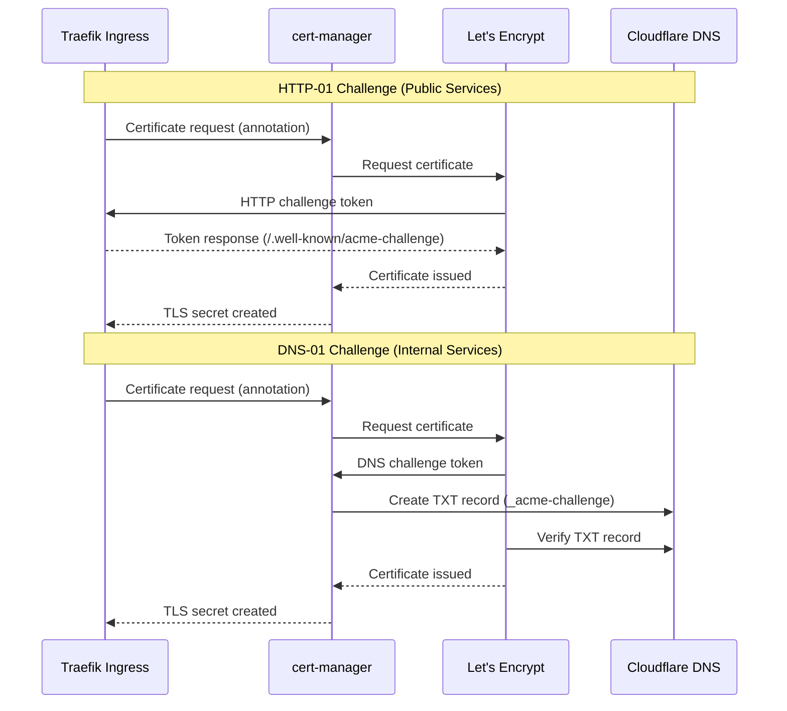

# Cert-Manager Module

Automated TLS certificate management using Let's Encrypt.

## Overview

This module deploys [cert-manager](https://cert-manager.io/) on the K3s cluster and configures ClusterIssuers for automatic certificate provisioning. It supports both HTTP-01 and DNS-01 ACME challenges.

## Architecture



## Challenge Types

| Type | Use Case | Requirements |
|------|----------|--------------|
| **HTTP-01** | Public services accessible from internet | Port 80 open, public DNS |
| **DNS-01** | Internal services, wildcards, private networks | Cloudflare API token |

## Access

| Item | Value |
|------|-------|
| **Namespace** | `cert-manager` |
| **HTTP-01 Issuer** | `letsencrypt-prod` / `letsencrypt-staging` |
| **DNS-01 Issuer** | `letsencrypt-dns-prod` / `letsencrypt-dns-staging` |

## Configuration

### Variables

| Variable | Description | Type | Default | Required |
|----------|-------------|------|---------|----------|
| `kubeconfig_path` | Path to kubeconfig file | `string` | - | Yes |
| `email_address` | Email for Let's Encrypt notifications | `string` | - | Yes |
| `environment` | `prod` or `staging` (staging for testing) | `string` | `prod` | No |
| `enable_dns01` | Enable DNS-01 challenge via Cloudflare | `bool` | `false` | No |
| `cloudflare_api_token` | Cloudflare API token (Zone:DNS:Edit) | `string` | `""` | If DNS-01 |
| `dns_zone` | DNS zone (e.g., `jigga.xyz`) | `string` | `""` | If DNS-01 |

### terraform.tfvars Example

```hcl
# Cert-Manager Configuration
email_address = "admin@jigga.xyz"
environment   = "prod"  # Use "staging" for testing

# DNS-01 Challenge (for internal services)
enable_dns01         = true
dns_zone             = "jigga.xyz"
# cloudflare_api_token loaded via TF_VAR_cloudflare_api_token from .env
```

## Usage

### Requesting a Certificate (Ingress Annotation)

```yaml
apiVersion: networking.k8s.io/v1
kind: Ingress
metadata:
  name: my-app
  annotations:
    # For public services (HTTP-01)
    cert-manager.io/cluster-issuer: "letsencrypt-prod"

    # OR for internal services (DNS-01)
    cert-manager.io/cluster-issuer: "letsencrypt-dns-prod"
spec:
  tls:
    - hosts:
        - my-app.jigga.xyz
      secretName: my-app-tls
  rules:
    - host: my-app.jigga.xyz
      http:
        paths:
          - path: /
            pathType: Prefix
            backend:
              service:
                name: my-app
                port:
                  number: 80
```

### Requesting a Certificate (Certificate Resource)

```yaml
apiVersion: cert-manager.io/v1
kind: Certificate
metadata:
  name: my-app-cert
  namespace: my-namespace
spec:
  secretName: my-app-tls
  issuerRef:
    name: letsencrypt-dns-prod
    kind: ClusterIssuer
  dnsNames:
    - my-app.jigga.xyz
    - "*.my-app.jigga.xyz"  # Wildcard (DNS-01 only)
```

## Components Deployed

| Resource | Name | Purpose |
|----------|------|---------|
| Helm Release | `cert-manager` | Core cert-manager + CRDs |
| ClusterIssuer | `letsencrypt-{env}` | HTTP-01 challenge solver |
| ClusterIssuer | `letsencrypt-dns-{env}` | DNS-01 challenge solver |
| Secret | `cloudflare-api-token` | Cloudflare credentials (if DNS-01) |

## Troubleshooting

### Quick Diagnostics

```bash
# Use the troubleshoot script
./scripts/troubleshoot.sh cert-manager
```

### Check ClusterIssuers

```bash
kubectl get clusterissuers
kubectl describe clusterissuer letsencrypt-prod
kubectl describe clusterissuer letsencrypt-dns-prod
```

### Check Certificates

```bash
# List all certificates
kubectl get certificates --all-namespaces

# Check certificate status
kubectl describe certificate <name> -n <namespace>
```

### Check Certificate Requests

```bash
kubectl get certificaterequests --all-namespaces
kubectl describe certificaterequest <name> -n <namespace>
```

### Check Challenges (Active Renewals)

```bash
# Active challenges indicate pending validation
kubectl get challenges --all-namespaces

# Debug a stuck challenge
kubectl describe challenge <name> -n <namespace>
```

### Common Issues

#### Certificate Stuck in "Pending"

```bash
# Check the certificate request
kubectl get certificaterequests -n <namespace>
kubectl describe certificaterequest <name> -n <namespace>

# Check for challenge errors
kubectl get challenges -n <namespace>
kubectl logs -n cert-manager -l app=cert-manager
```

#### HTTP-01 Challenge Failing

- Verify port 80 is accessible from internet
- Check Traefik ingress is routing `.well-known/acme-challenge`
- Verify DNS points to your external IP

```bash
# Test HTTP-01 endpoint
curl -v http://your-domain.com/.well-known/acme-challenge/test
```

#### DNS-01 Challenge Failing

- Verify Cloudflare API token has `Zone:DNS:Edit` permission
- Check the secret exists:

```bash
kubectl get secret cloudflare-api-token -n cert-manager
```

- Check DNS propagation:

```bash
dig _acme-challenge.your-domain.com TXT
```

#### Rate Limits (Let's Encrypt)

- Use `staging` environment for testing
- Prod limit: 50 certificates per domain per week
- Check rate limit status: https://crt.sh/?q=your-domain.com

### View Logs

```bash
# Cert-manager controller logs
kubectl logs -n cert-manager -l app=cert-manager -f

# Webhook logs
kubectl logs -n cert-manager -l app=webhook -f
```

### Force Certificate Renewal

```bash
# Delete the certificate secret to trigger renewal
kubectl delete secret <tls-secret-name> -n <namespace>

# Or delete and recreate the certificate
kubectl delete certificate <name> -n <namespace>
```

## Cleanup

```bash
# Remove cert-manager only
./scripts/cleanup.sh cert-manager

# Manual removal
helm uninstall cert-manager -n cert-manager
kubectl delete namespace cert-manager
kubectl delete crd certificates.cert-manager.io certificaterequests.cert-manager.io \
  challenges.acme.cert-manager.io clusterissuers.cert-manager.io issuers.cert-manager.io \
  orders.acme.cert-manager.io
```

## Security Notes

- Cloudflare API token is created directly in-cluster via `kubectl create secret` (never written to disk)
- Use a scoped API token with minimal permissions (Zone:DNS:Edit for specific zone only)
- Staging certificates are not trusted by browsers but don't count against rate limits
