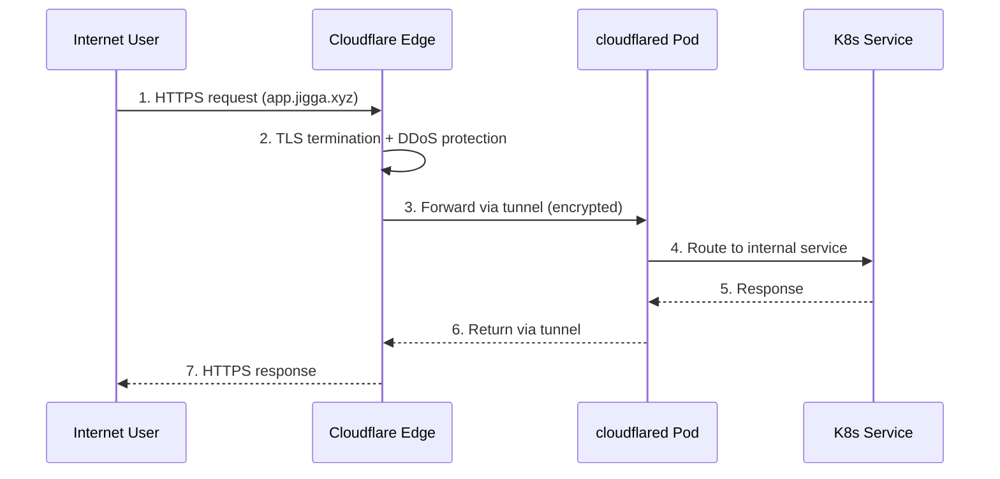

# Cloudflare Tunnel Module

Deploys [cloudflared](https://developers.cloudflare.com/cloudflare-one/connections/connect-networks/) to expose Kubernetes services publicly via Cloudflare's Zero Trust network.

## Features

- **Zero Trust Access**: Expose services without opening firewall ports
- **Automatic TLS**: Cloudflare handles SSL certificates
- **DDoS Protection**: Traffic proxied through Cloudflare's network
- **DNS Management**: Automatically creates CNAME records for tunnel hostnames
- **High Availability**: Configurable replicas for redundancy
- **Metrics**: Exposes Prometheus metrics on port 2000

## Architecture



## Prerequisites

1. **Cloudflare Account** with a domain configured
2. **Create a Tunnel** via Cloudflare Zero Trust dashboard or CLI:
   ```bash
   cloudflared tunnel create jigga-tunnel
   ```
3. **Get Tunnel Credentials** from `~/.cloudflared/<TUNNEL_ID>.json`

## Usage

```hcl
module "cloudflare_tunnel" {
  source = "./modules/cloudflare-tunnel"

  kubeconfig_path          = var.kubeconfig_path
  deploy_cloudflare_tunnel = true

  tunnel_name = "jigga-tunnel"
  tunnel_credentials = {
    account_tag   = "your-account-tag"
    tunnel_secret = "your-tunnel-secret"
    tunnel_id     = "your-tunnel-id"
  }

  ingress_rules = [
    {
      hostname = "app.example.com"
      service  = "http://my-service.default.svc.cluster.local:80"
    },
    {
      hostname = "api.example.com"
      service  = "http://api-service.default.svc.cluster.local:8080"
    }
  ]

  cloudflare_zone_id = "your-zone-id"
  create_dns_records = true
  replicas           = 2
}
```

## Variables

| Name | Description | Type | Default | Required |
|------|-------------|------|---------|----------|
| `kubeconfig_path` | Path to the kubeconfig file | `string` | - | yes |
| `deploy_cloudflare_tunnel` | Whether to deploy the tunnel | `bool` | `false` | no |
| `tunnel_name` | Name of the Cloudflare Tunnel | `string` | `"jigga-tunnel"` | no |
| `tunnel_credentials` | Tunnel credentials from cloudflared | `object` | - | yes |
| `ingress_rules` | List of hostname → service mappings | `list(object)` | See variables.tf | no |
| `replicas` | Number of cloudflared replicas | `number` | `2` | no |
| `cloudflare_zone_id` | Zone ID for DNS record creation | `string` | `""` | no |
| `create_dns_records` | Auto-create CNAME records | `bool` | `true` | no |

## Outputs

| Name | Description |
|------|-------------|
| `namespace` | Namespace where tunnel is deployed |
| `tunnel_name` | Name of the Cloudflare Tunnel |
| `metrics_service` | Service endpoint for Prometheus scraping |

## Adding New Services

1. Add an ingress rule to `ingress_rules`:
   ```hcl
   {
     hostname = "newapp.jigga.xyz"
     service  = "http://newapp.namespace.svc.cluster.local:80"
   }
   ```

2. Run `terraform apply`

3. DNS record is automatically created (if `create_dns_records = true`)

## Monitoring

The tunnel exposes metrics at `cloudflared-metrics.cloudflare.svc.cluster.local:2000`:

- `cloudflared_tunnel_total_requests` - Total requests through tunnel
- `cloudflared_tunnel_request_errors` - Failed requests
- `cloudflared_tunnel_concurrent_requests_per_tunnel` - Active connections

## Troubleshooting

```bash
# Check tunnel status
kubectl logs -n cloudflare -l app=cloudflared

# Verify tunnel connectivity
kubectl exec -n cloudflare deploy/cloudflared -- cloudflared tunnel info

# Check metrics
kubectl port-forward -n cloudflare svc/cloudflared-metrics 2000:2000
curl localhost:2000/metrics
```

## Security Considerations

- Tunnel credentials are stored as a Kubernetes Secret
- Consider using [Cloudflare Access](https://developers.cloudflare.com/cloudflare-one/policies/access/) for authentication
- Use `terraform.tfvars` (gitignored) for sensitive values
