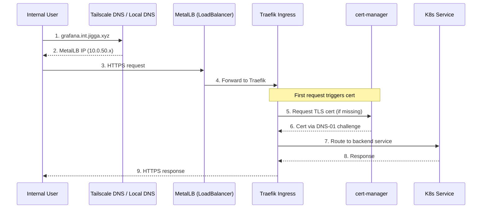

# Ingress Module

Centralized Traefik Ingress management for internal services.

## Overview

This module creates Kubernetes Ingress resources for internal services, routing traffic through Traefik with automatic TLS certificate provisioning via cert-manager.

## Architecture



## Services Exposed

| Service | Domain | Backend | Port |
|---------|--------|---------|------|
| Grafana | `grafana.int.jigga.xyz` | `kube-prometheus-stack-grafana` | 80 |
| ArgoCD | `argocd.int.jigga.xyz` | `argocd-server` | 80 |

## Configuration

### Variables

| Variable | Description | Type | Default |
|----------|-------------|------|---------|
| `kubeconfig_path` | Path to kubeconfig file | `string` | - |
| `grafana_domain` | Domain for Grafana | `string` | `grafana.int.jigga.xyz` |
| `argocd_domain` | Domain for ArgoCD | `string` | `argocd.int.jigga.xyz` |
| `deploy_argocd` | Create ArgoCD ingress | `bool` | `false` |
| `enable_tls` | Enable TLS via cert-manager | `bool` | `true` |
| `cluster_issuer` | ClusterIssuer name | `string` | `letsencrypt-dns-prod` |

### terraform.tfvars Example

```hcl
# Ingress domains (internal services use .int subdomain)
grafana_domain = "grafana.int.jigga.xyz"
argocd_domain  = "argocd.int.jigga.xyz"

# TLS Configuration
enable_tls     = true
cluster_issuer = "letsencrypt-dns-prod"  # DNS-01 for internal services
```

## How It Works

1. **Traefik** (K3s built-in) handles ingress routing
2. **MetalLB** provides LoadBalancer IP for Traefik service
3. **cert-manager** auto-provisions TLS certs via DNS-01 challenge
4. **DNS** (Cloudflare + Tailscale MagicDNS) resolves `*.int.jigga.xyz`

### Why DNS-01 for Internal Services?

Internal services aren't accessible from the internet, so HTTP-01 challenges fail. DNS-01 validates domain ownership via DNS TXT records, which works regardless of network accessibility.

## Adding a New Service

1. Add variables in `variables.tf`:

```hcl
variable "myapp_domain" {
  description = "Domain for MyApp"
  type        = string
  default     = "myapp.int.jigga.xyz"
}
```

2. Add Ingress resource in `main.tf`:

```hcl
resource "kubernetes_manifest" "myapp_ingress" {
  manifest = {
    apiVersion = "networking.k8s.io/v1"
    kind       = "Ingress"
    metadata = {
      name      = "myapp-ingress"
      namespace = "myapp"
      annotations = var.enable_tls ? {
        "cert-manager.io/cluster-issuer"                   = var.cluster_issuer
        "traefik.ingress.kubernetes.io/router.entrypoints" = "websecure"
        "traefik.ingress.kubernetes.io/router.tls"         = "true"
      } : {}
    }
    spec = {
      ingressClassName = "traefik"
      tls = var.enable_tls ? [
        {
          hosts      = [var.myapp_domain]
          secretName = "myapp-tls"
        }
      ] : null
      rules = [
        {
          host = var.myapp_domain
          http = {
            paths = [
              {
                path     = "/"
                pathType = "Prefix"
                backend = {
                  service = {
                    name = "myapp-service"
                    port = { number = 80 }
                  }
                }
              }
            ]
          }
        }
      ]
    }
  }
}
```

3. Add DNS record in Cloudflare (or let Tailscale handle via MagicDNS)

## Troubleshooting

### Quick Diagnostics

```bash
./scripts/troubleshoot.sh traefik
```

### Check Ingress Resources

```bash
# List all ingresses
kubectl get ingress --all-namespaces

# Describe specific ingress
kubectl describe ingress grafana-ingress -n monitoring
kubectl describe ingress argocd-ingress -n argocd
```

### Check TLS Certificates

```bash
# Check if certs are issued
kubectl get certificates --all-namespaces

# Check cert details
kubectl describe certificate grafana-tls -n monitoring
```

### Check Traefik Routing

```bash
# View Traefik logs
kubectl logs -n kube-system -l app.kubernetes.io/name=traefik

# Check Traefik service
kubectl get svc -n kube-system traefik
```

### Common Issues

#### 404 Not Found

- Verify ingress host matches request hostname
- Check backend service exists and has endpoints:
  ```bash
  kubectl get endpoints -n <namespace> <service-name>
  ```

#### 502 Bad Gateway

- Backend service is down or misconfigured
- Check pod is running:
  ```bash
  kubectl get pods -n <namespace> -l app=<app-name>
  ```

#### Certificate Not Issued

- Check cert-manager logs:
  ```bash
  kubectl logs -n cert-manager -l app=cert-manager
  ```
- Verify ClusterIssuer is ready:
  ```bash
  kubectl get clusterissuer
  ```
- Check challenges:
  ```bash
  kubectl get challenges --all-namespaces
  ```

#### DNS Not Resolving

- Verify DNS record exists in Cloudflare
- For Tailscale access, ensure MagicDNS is enabled
- Test resolution:
  ```bash
  nslookup grafana.int.jigga.xyz
  ```

### Test Connectivity

```bash
# From within cluster
kubectl run curl --rm -it --image=curlimages/curl -- \
  curl -v https://grafana.int.jigga.xyz

# From local (via Tailscale)
curl -v https://grafana.int.jigga.xyz
```

## Cleanup

Ingress resources are removed when the module is destroyed via Terraform. To manually remove:

```bash
kubectl delete ingress grafana-ingress -n monitoring
kubectl delete ingress argocd-ingress -n argocd
```
