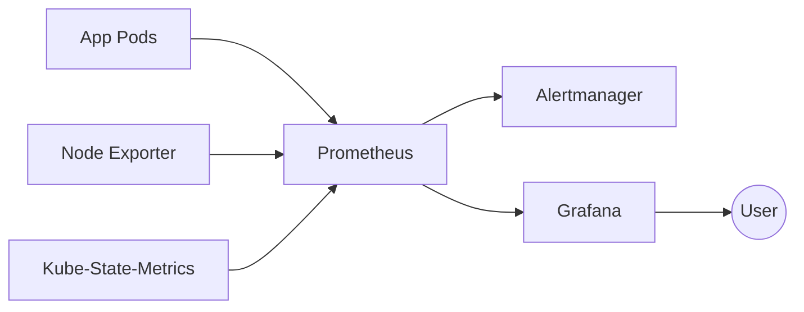

# Monitoring Module

Observability stack for Kubernetes using Prometheus, Grafana, and Alertmanager.

## Overview

This module deploys the [kube-prometheus-stack](https://github.com/prometheus-community/helm-charts/tree/main/charts/kube-prometheus-stack) Helm chart, providing comprehensive monitoring and alerting for the K3s cluster.

## Architecture



## Components

| Component | Purpose | Storage |
|-----------|---------|---------|
| **Prometheus** | Metrics collection & alerting | 10Gi (Ceph RBD) |
| **Grafana** | Visualization & dashboards | 5Gi (Ceph RBD) |
| **Alertmanager** | Alert routing & deduplication | - |
| **Node Exporter** | Host-level metrics | - |
| **Kube-State-Metrics** | Kubernetes object metrics | - |

## Access

| Service | URL | Credentials |
|---------|-----|-------------|
| **Grafana** | https://grafana.int.jigga.xyz | admin / (from .env) |
| **Prometheus** | Port-forward only | - |
| **Alertmanager** | Port-forward only | - |

### Access via Ingress (Grafana)

```bash
# Via Tailscale
open https://grafana.int.jigga.xyz
```

### Access via Port-Forward

```bash
# Grafana
kubectl port-forward -n monitoring svc/kube-prometheus-stack-grafana 3000:80

# Prometheus
kubectl port-forward -n monitoring svc/kube-prometheus-stack-prometheus 9090:9090

# Alertmanager
kubectl port-forward -n monitoring svc/kube-prometheus-stack-alertmanager 9093:9093
```

## Configuration

### Variables

| Variable | Description | Type | Default |
|----------|-------------|------|---------|
| `deploy_monitoring` | Enable monitoring stack | `bool` | - |
| `kubeconfig_path` | Path to kubeconfig | `string` | - |
| `grafana_admin_password` | Grafana admin password | `string` | - |
| `grafana_domain` | Grafana ingress domain | `string` | `grafana.local` |
| `k3s_server_ip` | Control plane IP (for etcd metrics) | `string` | - |

### terraform.tfvars Example

```hcl
# Monitoring Configuration
deploy_monitoring = true
grafana_domain    = "grafana.int.jigga.xyz"

# grafana_admin_password loaded via TF_VAR_grafana_admin_password from .env
```

## Pre-installed Dashboards

| Dashboard | Grafana ID | Description |
|-----------|------------|-------------|
| K8s System Resources | 15759 | CPU, memory by namespace |
| K8s Cluster Resources | 15760 | Cluster-wide overview |
| K8s Node Resources | 15761 | Per-node metrics |
| Node Exporter Full | 1860 | Detailed host metrics |

### Import Additional Dashboards

1. Go to Grafana → Dashboards → Import
2. Enter Grafana.com dashboard ID
3. Select Prometheus data source
4. Click Import

**Recommended dashboards:**
- `13770` - K8s Nodes Overview
- `14282` - K8s Pod Resources
- `11074` - Node Exporter for Prometheus

## Alerting

Default alerts are included from kube-prometheus-stack. To configure notifications:

### Configure Slack Alerts

```bash
kubectl apply -f - <<EOF
apiVersion: v1
kind: Secret
metadata:
  name: alertmanager-config
  namespace: monitoring
stringData:
  alertmanager.yaml: |
    global:
      slack_api_url: 'https://hooks.slack.com/services/YOUR/WEBHOOK/URL'
    route:
      receiver: 'slack'
      group_by: ['alertname', 'namespace']
    receivers:
      - name: 'slack'
        slack_configs:
          - channel: '#alerts'
            send_resolved: true
EOF
```

## Metrics Retention

| Component | Retention | Storage |
|-----------|-----------|---------|
| Prometheus | 7 days | 10Gi Ceph RBD |
| Grafana | Persistent | 5Gi Ceph RBD |

To change retention, modify the Helm values in `main.tf`:

```hcl
prometheus:
  prometheusSpec:
    retention: 30d  # Change from 7d
```

## Troubleshooting

### Quick Diagnostics

```bash
./scripts/troubleshoot.sh monitoring
```

### Check Pod Status

```bash
kubectl get pods -n monitoring
```

### Check Prometheus Targets

```bash
# Port-forward to Prometheus
kubectl port-forward -n monitoring svc/kube-prometheus-stack-prometheus 9090:9090

# Open http://localhost:9090/targets
```

### Check ServiceMonitors

```bash
# List all ServiceMonitors
kubectl get servicemonitors -n monitoring

# Describe a specific one
kubectl describe servicemonitor kube-prometheus-stack-prometheus -n monitoring
```

### Check Persistent Volumes

```bash
kubectl get pvc -n monitoring
kubectl describe pvc prometheus-kube-prometheus-stack-prometheus-0 -n monitoring
```

### Common Issues

#### Prometheus Target Down

```bash
# Check if target endpoint is reachable
kubectl get endpoints -n <namespace> <service-name>

# Check ServiceMonitor selector matches service labels
kubectl get svc -n <namespace> <service> --show-labels
```

#### Grafana Dashboard Not Loading

```bash
# Check Grafana logs
kubectl logs -n monitoring -l app.kubernetes.io/name=grafana

# Verify data source
kubectl port-forward -n monitoring svc/kube-prometheus-stack-grafana 3000:80
# Go to Settings → Data Sources → Prometheus → Test
```

#### High Memory Usage

```bash
# Check Prometheus memory
kubectl top pod -n monitoring -l app.kubernetes.io/name=prometheus

# Check cardinality (high-cardinality labels cause memory issues)
# In Prometheus UI: Status → TSDB Status
```

#### etcd Metrics Missing

K3s embedded etcd requires manual endpoints. Verify:

```bash
kubectl get endpoints -n kube-system kube-prometheus-stack-kube-etcd
kubectl get svc -n kube-system kube-prometheus-stack-kube-etcd
```

### View Logs

```bash
# Prometheus
kubectl logs -n monitoring -l app.kubernetes.io/name=prometheus

# Grafana
kubectl logs -n monitoring -l app.kubernetes.io/name=grafana

# Alertmanager
kubectl logs -n monitoring -l app.kubernetes.io/name=alertmanager
```

## Cleanup

```bash
# Remove monitoring stack
./scripts/cleanup.sh monitoring

# Manual removal
helm uninstall kube-prometheus-stack -n monitoring
kubectl delete namespace monitoring

# Remove CRDs (optional)
kubectl get crd | grep monitoring.coreos | awk '{print $1}' | xargs kubectl delete crd
```

## Future Enhancements

The following are disabled but can be enabled in `main.tf`:

- **Loki** - Log aggregation (uncomment loki helm release)
- **Tempo** - Distributed tracing
- **Mimir** - Long-term metrics storage