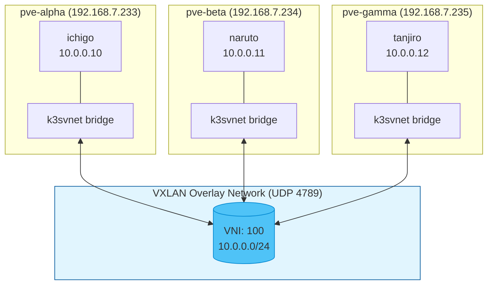

# Proxmox SDN Module

Creates a VXLAN overlay network across Proxmox nodes for cross-node VM communication. This eliminates the need to manually create `vmbr1` bridges on each Proxmox node.

## Overview

This module provisions:
- **VXLAN Zone** - Overlay network tunnel across all Proxmox nodes
- **VNet** - Virtual network that appears as a bridge on all nodes
- **Subnet** - IP range configuration for the overlay network
- **SDN Applier** - Applies pending SDN changes to make them active

## Architecture



**Traffic Flow:**
1. VM on `pve-alpha` sends packet to VM on `pve-gamma`
2. Packet enters local `k3svnet` bridge
3. VXLAN encapsulates packet (adds 50-byte header)
4. Encapsulated packet sent via UDP 4789 to destination Proxmox node
5. Destination node decapsulates and delivers to target VM

## Prerequisites

1. **Proxmox VE 8.1+** with SDN packages installed:
   ```bash
   apt install libpve-network-perl
   ```

2. **Network interfaces configuration** - Ensure `/etc/network/interfaces` sources the SDN config:
   ```bash
   # Add to /etc/network/interfaces if not present
   source /etc/network/interfaces.d/*
   ```

3. **UDP connectivity** between all Proxmox nodes on port 4789 (VXLAN default)

4. **Terraform user permissions** - The `terraform@pve` user needs:
   - `SDN.Allocate`
   - `SDN.Audit`
   - `SDN.Use`

   Add permissions:
   ```bash
   pveum role modify Terraform -privs "SDN.Allocate,SDN.Audit,SDN.Use"
   ```

## Usage

### Basic Usage (in root module)

```hcl
module "sdn" {
  source = "./modules/proxmox/sdn"
  count  = var.enable_sdn ? 1 : 0

  # Zone and VNet identifiers
  zone_id    = "k3szone"
  vnet_id    = "k3svnet"
  vnet_alias = "K3s Cluster Network"

  # Proxmox node IPs for VXLAN peer communication
  proxmox_node_ips = ["192.168.7.233", "192.168.7.234", "192.168.7.235"]

  # Network configuration
  mtu            = 1450
  subnet_cidr    = "10.0.0.0/24"
  subnet_gateway = "10.0.0.1"
}
```

### Using the VNet Bridge for VMs

After SDN is applied, use the VNet ID as the bridge for your VMs:

```hcl
# In your VM resource
network_device {
  bridge = var.enable_sdn ? module.sdn[0].vnet_bridge : "vmbr1"
}
```

## Inputs

| Name | Description | Type | Default | Required |
|------|-------------|------|---------|:--------:|
| `zone_id` | SDN VXLAN zone ID (max 8 chars) | `string` | `"k3szone"` | no |
| `vnet_id` | SDN VNet ID (max 8 chars) | `string` | `"k3svnet"` | no |
| `vnet_alias` | Human-readable alias for the VNet | `string` | `"K3s Cluster Network"` | no |
| `vxlan_tag` | VXLAN Network Identifier (1-16777215) | `number` | `100` | no |
| `proxmox_node_ips` | Proxmox node IPs for VXLAN peers | `list(string)` | - | yes |
| `mtu` | MTU for VXLAN (physical MTU - 50) | `number` | `1450` | no |
| `subnet_cidr` | CIDR for the SDN subnet | `string` | `"10.0.0.0/24"` | no |
| `subnet_gateway` | Gateway IP for the subnet | `string` | `"10.0.0.1"` | no |
| `enable_snat` | Enable SNAT for outbound internet | `bool` | `false` | no |

## Outputs

| Name | Description |
|------|-------------|
| `zone_id` | The SDN VXLAN zone ID |
| `vnet_id` | The SDN VNet ID |
| `vnet_bridge` | Bridge name for VM network config |
| `subnet_cidr` | The SDN subnet CIDR |
| `subnet_gateway` | The SDN subnet gateway |
| `sdn_ready` | Indicates SDN is applied and ready |
